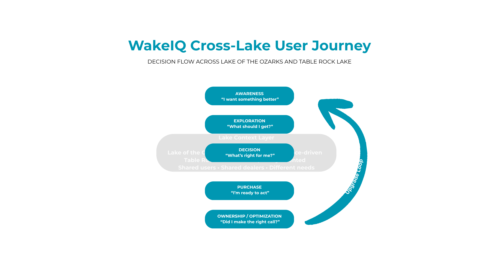

<<<<<<< HEAD
This is a [Next.js](https://nextjs.org) project bootstrapped with [`create-next-app`](https://nextjs.org/docs/app/api-reference/cli/create-next-app).

## Getting Started

First, run the development server:

```bash
npm run dev
# or
yarn dev
# or
pnpm dev
# or
bun dev
```

Open [http://localhost:3000](http://localhost:3000) with your browser to see the result.

You can start editing the page by modifying `app/page.tsx`. The page auto-updates as you edit the file.

This project uses [`next/font`](https://nextjs.org/docs/app/building-your-application/optimizing/fonts) to automatically optimize and load [Geist](https://vercel.com/font), a new font family for Vercel.

## Learn More

To learn more about Next.js, take a look at the following resources:

- [Next.js Documentation](https://nextjs.org/docs) - learn about Next.js features and API.
- [Learn Next.js](https://nextjs.org/learn) - an interactive Next.js tutorial.

You can check out [the Next.js GitHub repository](https://github.com/vercel/next.js) - your feedback and contributions are welcome!

## Deploy on Vercel

The easiest way to deploy your Next.js app is to use the [Vercel Platform](https://vercel.com/new?utm_medium=default-template&filter=next.js&utm_source=create-next-app&utm_campaign=create-next-app-readme) from the creators of Next.js.

Check out our [Next.js deployment documentation](https://nextjs.org/docs/app/building-your-application/deploying) for more details.
=======
# WakeIQ  
**Smarter boating starts here.**

---

## Overview

WakeIQ is a decision-driven platform concept designed to guide users through the boating journey across Lake of the Ozarks and Table Rock Lake.

The current market is rich in content and dealer presence—but lacks a structured system to help users make informed decisions. WakeIQ introduces a decision layer that connects exploration, purchase, and ownership into a single guided experience.

---

## The Problem

The boating ecosystem across these lakes is fragmented.

Users rely on:
- Dealer websites  
- Local media platforms  
- Word of mouth  

But there is no unified system to help them:

- Determine what boat fits their lifestyle  
- Understand differences between lakes  
- Compare dealers effectively  
- Navigate the buying process  
- Optimize their setup after purchase  

This leads to confusion, inefficiency, and missed opportunities.

---

## Market Insight

Existing platforms serve different roles:

- Lake Expo → news, events, classifieds  
- Lost on the Lake → lifestyle and community  

While valuable, neither platform supports **decision-making at the moment of purchase**.

👉 High-intent users are left without guidance when it matters most.

---

## Cross-Lake Complexity

The market is not isolated to one lake.

Users frequently move between:
- Lake of the Ozarks (high traffic, performance-driven)
- Table Rock Lake (calmer, family-oriented)

These differences directly impact:
- Boat selection  
- Dealer choice  
- Dock and lift requirements  

Yet no platform accounts for this shared ecosystem.

---

## User Journey

Awareness → Exploration → Decision → Purchase → Ownership → Upgrade Loop

WakeIQ is designed to support users at every stage of this journey.



---

## Product Concept

WakeIQ introduces five core components:

### Decision Engine  
Recommends boat types based on user inputs like budget, usage, and primary lake.

### Dealer Matching  
Connects users with dealers aligned to their needs and preferences.

### Lake Intelligence Layer  
Provides lake-specific insights that influence decision-making.

### Event Optimization  
Guides users on which boat shows to attend and how to prepare.

### Setup & Ownership Tools  
Helps users optimize dock setup, accessories, and long-term ownership decisions.

---

## Monetization Strategy

- Dealer lead generation  
- Featured placements  
- Sponsored listings  
- Event partnerships  

---

## Outcome

WakeIQ transforms a fragmented, content-driven ecosystem into a structured, decision-focused platform that benefits both users and dealers.

---

## Status

This is an active product concept and portfolio case study.

### Next Steps:
- User journey visualization  
- Homepage wireframe  
- Dealer experience design  
- Interactive decision tools   wakeiq-platform-concept
>>>>>>> daafe62919bfd742d71d5b6ab9c0dc7f8c9e18a5
