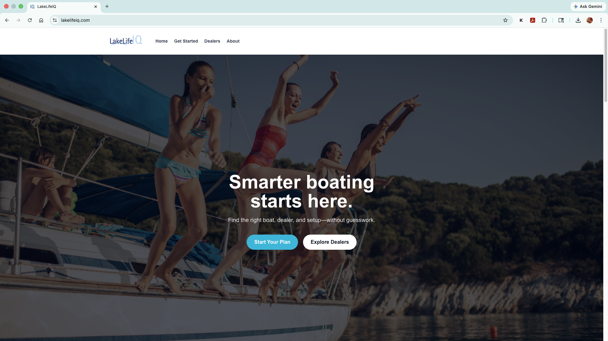
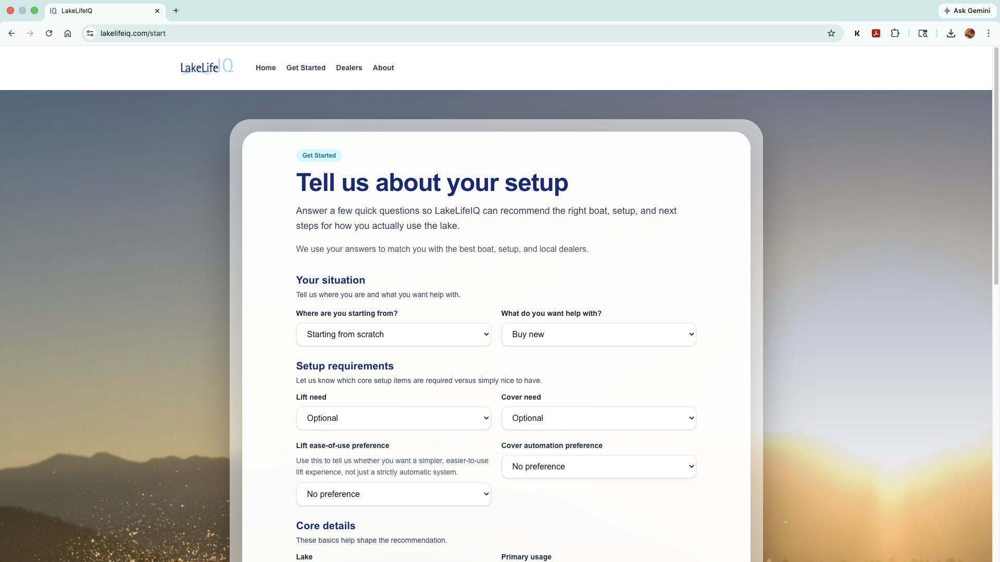
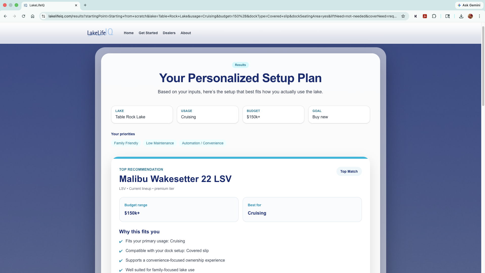
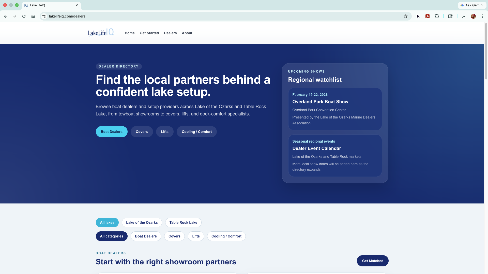
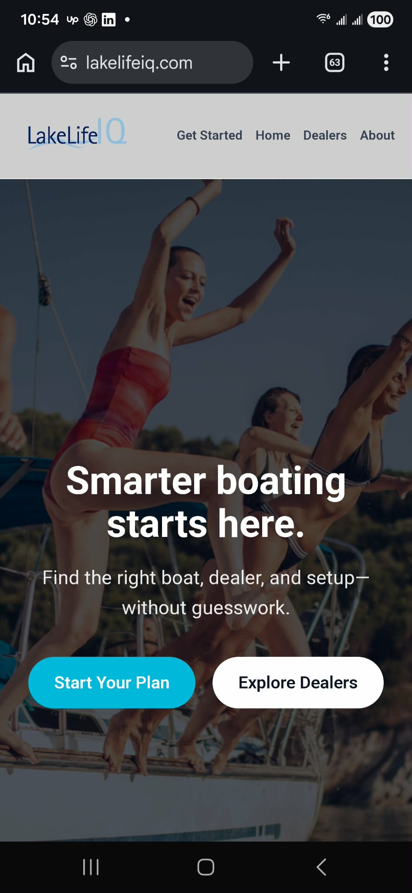

# LakeLifeIQ

LakeLifeIQ is a live validation-stage boating decision platform that helps users plan the boat, dock setup, upgrades, and next steps around a realistic lake-use scenario.

## Live URL

[https://lakelifeiq.com](https://lakelifeiq.com)

## Why I Built This

Most recreational boating decisions are framed too narrowly around the boat itself.

In reality, buyers are also trying to understand dock compatibility, lift and cover requirements, comfort upgrades, local dealer and provider options, and whether the full setup makes sense inside a real budget.

I built LakeLifeIQ to make that broader decision easier to understand. The product is meant to reduce guesswork, create better next-step clarity, and test whether a more structured boat-first planning workflow creates value for both users and local marine businesses.

## What The Product Does

LakeLifeIQ guides users through a short setup flow and returns a structured recommendation based on:

- Lake
- Primary usage
- Budget
- Dock setup
- Lift and cover needs
- Automation preferences
- Comfort and maintenance priorities

The output is intentionally broader than a simple boat match. It can include a recommended boat fit, remaining upgrade budget logic, setup-aware lift and cover recommendations, comfort upgrades, and relevant next steps such as exploring a local dealer directory.

## Core Features

- Guided setup flow for lake, usage, budget, dock, and upgrade inputs
- Boat-first recommendation logic on the results page
- Setup-aware upgrade recommendations for lifts, covers, and comfort systems
- Dealer directory filtered by lake and setup context
- Contact flow for support, feedback, and partnership conversations
- Mobile-friendly customer-facing pages across the planning journey
- Privacy-safe outbound dealer click tracking through internal redirects

## Technical Highlights

- Next.js App Router
- React
- TypeScript
- Tailwind CSS
- Resend contact flow
- Dealer directory with filter-driven navigation
- Outbound dealer click tracking for analytics and demand measurement
- Recommendation and filtering logic that ties together boats, upgrades, lake context, and budget constraints

## Product / Business Thinking

- Boat-first planning: recommendations start with the boat, then account for what remains in the setup budget
- Full setup recommendations: dock, lift, cover, comfort, and local provider context are part of the decision, not an afterthought
- Early launch / validation phase: the product is live, but still focused on learning what users actually find useful
- Dealer / provider demand measurement: recommendation engagement and outbound click activity help measure local interest without positioning the product as a live paid lead-routing platform

## Launch Status

LakeLifeIQ is live and usable today as a validation-stage product.

The current version is focused on:

- validating whether users want a broader boating planning workflow
- measuring which recommendation paths are most useful
- understanding dealer and provider interest by lake and category
- refining product logic before any future monetized dealer lead-routing workflow becomes active

Paid dealer lead routing is not currently live.

## Screenshots

### Home


### Setup Flow


### Personalized Results


### Dealer Directory


### Mobile Experience


## Future Roadmap

- Improve recommendation scoring beyond rules-based filtering
- Expand inventory and provider coverage by lake and category
- Add richer results explanations, comparisons, and planning outputs
- Strengthen analytics around recommendation usefulness and dealer/provider demand
- Evolve the product into a deeper decision-support workflow once validation is stronger

## Local Development

```bash
npm install
npm run dev
```

Open [http://localhost:3000](http://localhost:3000).

For a production check:

```bash
npm run build
```
